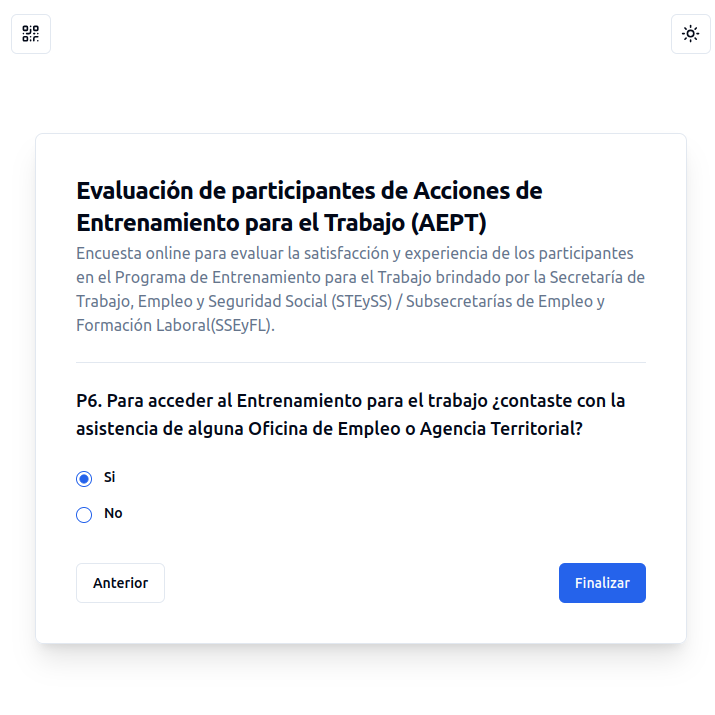

# Propuesta de integración del sistema de encuestas

La integración del sistema de encuestas con otros sistemas se llevará adelante mediante redirecciones y callbacks.

El sitio consumidor del servicio de encuestas redirige a su usuario al sitio de encuestas, pasando en el querystring los siguientes parámetros:

- encuesta: código de encuesta a ser respondida por el usuario
- callback: dirección a la cual el sistema de encuestas redireccionará al usuario una vez que haya terminado de completar la encuesta, pasando a su vez el id de las respuesta generada vía querystring.
- referencia: opcionalmente el sistema consumidor puede especificar una "referencia" con la cual identificar a esa respuesta. La "referencia" es un id significativo para el sistema consumidor que puede ser utilizado para su posterior consulta.

Ejemplo:

- el portal de empleo (consumidor del servicio de encuestas) redirige al usuario para que complete la encuesta cuyo código es VAT, y especifica a su vez el callback al cual redireccionar al usuario junto con el id de la respuesta:

```
REDIRECT https://trabajo.gob.ar/encuestas?encuesta=VAT&callback=https://trabajo.gob.ar/portal-empleo/cb?formato=json&referencia=beneficiario_999874
```

- una vez completada toda la información, el sistema de encuestas grabará la respuesta, y redireccionará al usuario al callback especificado:

```
REDIRECT https://trabajo.gob.ar/portal-empleo/cb?respuesta_id=answ_advf-wert-12dr-345d&reference=beneficiario_999874
```

Posteriormente mediante la API rest puede consultar la respuesta por respuesta_id o por referencia:

```
GET https://trabajo.gob.ar/encuestas/api/encuestas/answ_advf-wert-12dr-345d

o bien

GET https://trabajo.gob.ar/encuestas/api/encuestas?referencia=beneficiario_999874
```

que retornará la siguiente información:

```JSON
{
  "survey": {
    "id": "answ_advf-wert-12dr-345d",
    "survey_id": "surv_defs-wsd4-er34-fd23",
    "reference": "beneficiario_999874",
    "code": "vat",
    "title": "Evaluación de participantes de Volver al Trabajo (VAT)",
    "description": "Encuesta online para evaluar ...",
    "questions": [
      {
        "id": "preg_1",
        "code": "P1",
        "title": "¿Cuán satisfecho estás con el programa de capacitación?",
        "kind": "single",
        "options": [ "Muy satisfecho", "Satisfecho", "Indistinto", "Insatisfecho", "Muy insatisfecho" ],
        "answer": "Muy satisfecho"
      },
      {
        "id": "preg_2",
        "code": "P2",
        "title": "¿Cómo fue tu experiencia en relación a los siguientes aspectos de la gestión programa de capacitación?",
        "kind": "grid-single",
        "items": [ "Registro en el Portal Empleo", "Búsqueda de la oferta", "Postulación a la oferta" ],
        "options": [
          "Buena",
          "Regular",
          "Mala"
        ],
        "answer": {
          "Registro en el Portal Empleo": "Regular",
          "Búsqueda de la oferta": "Buena",
          "Postulación a la oferta": "Mala"
        }
      }
    ]
  }
}
```
