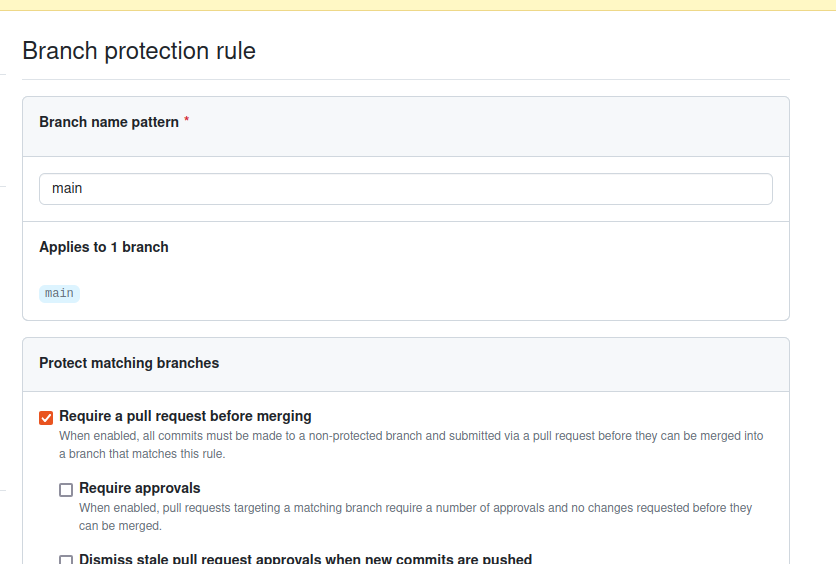

# checklist demo

- requerimiento y prototipo
- intro a svelte
- mostrar el prototipo

  - proceso de desarrollo - development workflow o pipeline de desarrollo

- proceso de colaboración y desarrollo de software que
  - utiliza herramientas de código abierto y servicios en la nube para gestionar y desplegar aplicaciones web.
  - creación de un repositorio en github
  - crean pull requests (feature branches)
  - deploy automático en vercel
  - herramientas de control de calidad
    - formatting and linting
    - testing: pruebas unitarias, de componentes, de APIs y de integración
  - devops: optimización, pruebas y deploy automático

## explicar el requerimiento

## mostrar la app final: https://encuestas-online.vercel.app

- mostrar qr: https://encuestas-online.vercel.app/qr

## intro general a UI frameworks

- Node.js: 2009
- Angular 1.x: 2010
- React: 2013
- Svelte: 2016
- Next.js: 2016
- SvelteKit: 2020

---

## intro a svelte

- svelte repl: https://svelte.dev/repl/

- [svelte repl toUpper/toLower](https://svelte.dev/repl/d15ba2cc401f471f9e292b4f6bed0f07?version=4.2.18)

- [todos in svelte 5](https://svelte-5-preview.vercel.app/#H4sIAAAAAAAAA708iXbbRpK_0paTIekQIMBDEmlJGUfW7M5OnMwbe97uPivPAYmmiAgE-ABQh_n471tVfaAbB6nMZteyZaKP6uq6q7rB3ckyinl-Mvu8O0mCNT-ZnbzbbE76J8XzBh_yBx4XHJ7zdJstsOXileOwD-9_Yh-pi01YsS3SLAriGfPOnIQ_FU5e8E3OHOfqNqHhOedsVRSbfDYYhBzmpRueuev0axTHgZtmdwOeOP_8OAjTRT74kQdZMviUpnH-JUjCLwXPiyi5G1zHEU8AdhTyL_8RPAQfF1m0Kb4sM0D7Mc3u84HA6EsO6PD8dcY38ZehxCKnwfCJsWi9SbOCfUrDNGfLLF2zjjugJ1fstnOb3BZy1LuYw281ip6MUTAu5gUrCNQl-yYvgoJ3P-MqjO1YFM6Y32dI1xnrXGccelmgCAeDs4JnLNhsOn22SNcbgMVhSpFtOdv3TSjDKpRnYAdbRlle0Mw0AdIchTIqochxrFhxBsQqWLqkz4qXNqxlEOcADGH90gNqDjQ54UGQaIBUFjSdR0k4EzQZiCF58Rxz-Dh4w_5x8_Hm00f2ZnCbzO7idB7E3Te9vvEwm835EhhYaQyWQKse2yEO8_QJxOArCMUMPmchzxxoenub7M0py3SxzeWMdFvEUQI7H22eWBjkKx6y18Ph-Zwv3hr9Trpc5rwAQbaBrYp1LCEt0wT6T4fu5Fs2YL7rT1geJLmT8yxaVmb55h5WQwlhHWR3UQIYF0W6ri21VQvFUY6KBISbsQT4S3hugjCkbVdmzbcALNHkQZIYs8SKYlIFBmOPUVisZiwAxgtSPPBsGaePM_YQ5dE8FiDmweL-Lku3CUkWbHgTZCBy1LdI4xSWi5IV0EA0CSqZLUTeFY_uVgVilq2DmNqdRz6_jwoHZzj5Ok2LFSFnznXAUjhp_nR4kAQE6gQGJEgWJd1qhJrNCCRJiBMliSFZgnTN5DW4GSWbbWE2pJsC6bMx23Ie84U1qgDrCIQLDGFylsE6ip_r9EMRhz34nvdtnYIoeDXevgBjuU3NTUcy73EVFdzk5utxiD9vGWsTin0F9md0GZe3J7jH25NfLIo6WRBG21ygeVuAHYjuQAg46GJ2L5aEPWeMAOVkHW4LanbyxYqjzYpx45VNpuGzXEZKsSbWOnhyZNvpecbXNq1KaReC6runMGbgu8MJe4fmr28rdRPFXi8n-NNEM0Lyz2seRgEDS8l5wsCRse4a1F4hNfQ2TxL3hu3YEuBO1Q5qUjDyJ2dT6trTqoM3Nz-9l0aWqIg2999-_PmHdz-yj5_--8cb2_S6QPS1Q4LLrtgBNoZRvokDklLCYB6ni3uDqE6RboCw7lhgajDJnRfKMJWWx0WeMB9_ee6Z2p3WPneIPXkaR6FBVKDzNsuR0Js0SsAdUBvi6ZBJwr3M2CLYREUQA-XqeLhFencXA_aFbSsVV_zNk4GI5nQ4wp-D4D4HIDbOBlxpzkOkHnjfknqEY8gXaRYUEZgfBnLEMyRk03KmFJnLffkSBsmdtlVaDpetIroIRovRommNeTj0R17TGhAPFhV7qGaRCt5l_Llp3iaLQBSeX46c5zWuL-HMQOICMDShBRDNhUSgAebrySn-1KEKCa-K8jLmgt2_bSHCXD4DFJAqtAfg3RbAVl48gu62gQOFeaPsOEAC6YGf8fTbQ-PZd3qO1JuYLwulEJWZcTDnsfOYoUfLrFnKd4t1PfjRho9EDcT_DgYtuNQSEyoY8G0Qx8_OKgpDrlUzzSMhmsEc9G4LoeErEQIH0strmyN1pKIypYcQcIW-xhFYhQycYBfGMeNfr6G_z6xfYgg5JocYgv4cqWFv6PMiDvL8DegcBNSLe1A6gzGWcTLNVUv05RIMCDGAQs38IlDoKOr8EnNjGMcPzIXIUU897CMmk7qPOIBgFcWxMqv7BgBNWFbxPDcA1PfJnxZ8gyLTTB-9R_A_6JLqPsiAiMkCSHktOjEMiBJ88gweG9N_djzrK3xLYc54DBb3QZlZSBtWQYhC6rEhCOIY_nksu5sHXa_P5F932OtjP_GJTcR61TF-71_moL1ZA_9xC73lBEusdXQz8ezoRhoUHeDI1kwor2xuho7-s76AtCzNUyDFqRhVMzCowmixTlWrVlFRv8UyfvkS3-lcyQqKPH9yelbG0Y-yY-RVEyC3EhpW13yBOaWYyUBFAx9WoxoUOBnS1F2fBmOlrW2BgS3LUQI5K3kBkuo284jQXxLQVXnWFIkeWmCWpEV3Bo2Fs1hFcdhrznv9F1rBpki5bVMWskO3TaFEiKOIXE8dhDBuiaylxoAhw_oGA38EsSkm5rkdS6NatMYY-MEJI_R1wjKlj2U7ejXIwWq-jUDW4gzD31fHOiivbfsCmiodGZe0MbRBGNVSKRoktzHC0itXhPeIiAJBr__95vpvP_z8X425ycJZzI9VfCo5dHPy1lZjgNAGhkcBhOx1azGW1sIS_1NFmorFGYo8sMEKtvgiixljGUNJVkgTPvZk8yLmAUbf0FohPFIIxIPMYVPdTA2wEjvIpxf3QD0zR2-lLrlzZygxEYjpRylhGv_KhhowPYLISxnVlAfWI1hq_upEkGthdN7gaVIIK6PiuR4GmoQ1azVCDmqVmqYSjiUhZsfRVNqMTQ39PMfIeQK_JkoumrLhdLtYOYE0MusgiTbbmJLOl4iOSrVkGnR7cntyiLZ1-wAoYVnwGh3W22osZ9cNf4d0CLMCkWoTtnYGr0TxcMG3nRBtZWZJE60XL6aRiId9S4GmlRTqvKI_Z_LZqGpkKR0tOONJyO96FvWJ8m_rpEBba4qL7AWEVEBRLeRa6vBH8Y4-A_W_ayKxXtEXULHsR-cLdGBw0j9Zp2G0jHh4MsOKyr6vT6noqOHgOVV5RqEOc37ij-TB1XGOfG449vkLRQg_UBFVDzcbG-YQRh-BTdvKsZJoa5lhDW0Y8wEk_R2pcwnVaLMPo-ScHQvoTGavZwTGwZX7W94RdBanVztGT4U-xcLzGyy9dD-DXca-PbZusnSTd3u4EMpxwUQUVR57dSAl7fTKUzHRD5yHESB44PnCrlhJzby8ZB00VQ-8w74Xp2gyNusW7PKKvSpcfQjVYzMZ4RmTdW_zfHs6E_NpGOLRqxzgSdbV_wwG4LuXsJVkwWGoxWgIbAo8axBkWW4TYgtLEwgU0gfe1TGhSeEmTMF4vroUXfC5Z0yQ4kM2sCs7BD_XPM8DSOMv2a8kSp1vdjQfVWTfYasgZ3MMqUNONPhVhsIVTLebENlnRK9k3vKCRQauSfhX9KMGupcWujgrWjICk3-OfiEkyi3hU88kam0HhbEDDcDcBdAfWkLkgL3RXxtW14wvUTBk4eWrg0tG4wU4yCVLwN9b8jfTorz_1RA0AAXgd8x1XfXcVw-iMLMXumixBFx-V1BMSo7kR6gZEvPkrlgBDh-CYuVCqt1VK8DDpuQSJF_fMR-w8w2k3M02X3XxTFgcCDed9R4TtCp3AGVTwkDJy-2QC3gXx12DBdbGhAiGLaph87KEIYlgqAoeZ9wEi1V9pjmvZWff7CzeXgu_RZz9ZyK9WGcPciCx3QtkW7RK6L86Zw-7ese1df9BI0MpYO0WTG53X-5EI3DYuFhmlOx59Qgf72iYNyDkpYkwemCUaeOBhqz5GOXD25MrsW2ar5wrTb0tLtQzJtBkuy53JFp7tiMB38vLAXK6cK5iNjRZDpguFEi7T5MKPc20xWpls03cRVhFsLphTAEHeqrgIK4vKBS2MURdMYYzeBR_e2KRwsE2mxiMjoAoyIl5OH-WEyEHCDCAF9QqGNu95iCipXsEDSJr0FXGdC_GAQpxZC2qQVAnUZf2QSQVUkkfhezJzQlIgzhSy884csFY4-onkWehZQWQkKnwV-aEAeJLtupisI1L-q8ym3xmqKKIaLYpmu9Ki2Cgq1Vlr3l8MQAJPBoFHr2sZERW1dtARsiUJjf5wgyZZIAloyU9Thzq_5z8hXKS1vE6uiq104qtME3HDsU46AQbAdq62-seQZhqT3M0Ru5Wx2LNPhcCmVUah3TRh8arSz-I3JyjCPAwAhYoFiNgbMEeDZu02IKLgCFBWNzrwcAwriiAbUKR_y6ORxtAaQDgxHE8E_cXSvciT1b7KKN34GWZSAkLLMcxyijYAuOwmKUZy4OHakAmgxxpuj-ZsY5kjfbR5J-NgcBjgSGYvzjiORPSuAiEVAMKpJsEqxJNtfwBWHwdKbfH-ANkVU1eROyoqzGVPNbMbYWON7rwDpyYQUTCUDXCKgp7COItxzKrAFryV3j-VqBYmOVPUVFhch1tJH-3jF24C8zDLb7ny2AbF10ZLUpK7QSS-xZqwcJioLSSOPj_CnEZs2t6V6L4I9yU2trKTVy9hF1iTxf1DsDG2k5NsYCsDWpVBwUAHlegP9daOT4Cd1iUlxolNClfpVswDXcppf0k1WAZbkpdbNqSuP9Qbkqz1IgnX9lhM_C5ytKcfLIROoqgkPD6OfkriC2awAR2TmYQP7A__Ymh0QcDho8iORI5oUKug2PKTmUrDdg3moIW_Dpha4Ds6MkMk4zjWfLWu9fSogHz9tpTYlax3dCNJ8VYpMRMlEj6ophCZ099xTkUYmKdxFg5WCwPgaDm2znI4OUOdW_fjA3b5nxGXu5yJyzLnl0JvllbKK8E0Q6EHF0QZoixCoB2MlzZ1yIjHAlTIQAUqo3b7JgJGwQXOKYELvZLsRpZp0uRXjDrKhKkK01rY3ypYgfoT5fLKkJyOm7fdt7YYkrZQJGD4o4G0ui7HCZlpKsyxhAzHUFjWBjCnTha3JdUl9uSenXCNCwmuX2Rb4ISYuXGBqxNqTBKjUFVkEmYVKI1EOAP4mleuBFIozgCRhJDIVXwrC7jXO5eCc4YKKNUHkM4MWXhxUiXfLgYoFSiPqnota5Jsq5eKpOqQvaVWpE1Q0V6TwWRqiqZnMaqpmaylM9acbNZItVmNNuFldwzmUNeVgoJezFBrfX7Fc2iZ6lZBvUOy7CSjKpYGjNMKUYR2Ze6U1pRzUZsOiYRrVJQlYHjyDHjbpyJqEyDNFqC638MYoq4u0G03KtM5TY5lKvIhPhoumJXpVvfX8CM5UO6Tcoyr1EKNkZZJq9_JM2RMb8qVajUXcVYOjOB_P1fSUs6nZ7ZcRM3RjxWsVXnKkIH3__8gXxxJRDBgtnxiNMorMnqE56sit5a7C26KqF3p1M-3sQqIKjgb-cn9gasip9kYFfQsaQ2xhvWAj0JGWKJchTEcChhffbIWbZNKlMoMrHClEqkQCUYMyTADUvDfrEaag2xbiGWNqNmpjxDKfX9HBj_n6sAuM15SNSYcxamCf_eNlSrofjQFgcYVRyxy32DN5fZXEvI4B0LFcTa-h4O9CBAERJUjFC7W2x1rvRA9HgXhoYlkY7tkN0wS2FHjUfDGVXdghgqXh7i6MqEPsepqHR70Cvv07DyqmvliqAsXO3-DGodwnJi-3KlfXOXKKa39JaF955hfTHczpMIBFUlLV2RWygoIvgXoNGmlUdJYpyoyDdHdOqmtxKZmclfUCcCumfWPXDdqn1Stwearomey2qkUqojrunjKn20XRJ93kkw9a4DsIogv8-NGYZM7gaSiPujB7CinPqiCpx9DHpQKFUp-_Mv7Y6lSIsgNo8WzXMR7WXMA4DKSFUhp-rPVfWIqASkQMky7k0smvgT-VcjndQOUY9sSxjBupJhssvDppXTICBZCOZ0gwXGOz5Ge2XgiLccsIa3I2Ls6WZaXu6Z7OohFhrF2eNvfNbOnF_Iwko189rgSK3gqcrCx2OLSmEPD5e0-zcOnER0Iw-LsZEOirFKIg-6Gn1_69lNw7GOPE9RxU5N_E_qNL1Z6loOd3oKDijrdZPsVuFf2geCxpm22no514L5PetsE0mSmSLOQStfTRxeHJlLGyk9KjO8pnWWiXvxDFOpObu_2onN7JEsdhj-v8ehgaImFtXDiStxXGdqmeHMj51XBFVt-y03NQ2LlToev02kjSkLq2a8IwtWFJ_i0XdTWUxMqNbFYFI96F4H95zl24yL-hoElyFfRgmeT0HCjHX4QK4P6rDmxSoNzasCqQzCLkX9U9XpXD2l5Q8WOGnCCpaJIcAU4TVOhQD1Brt-BCvJE1CaDpnTTl8t1gZU1TxpI3e8yKV9XuA7E3KuSgkyXmyzREX5IBc8L7L0eSbtDyEiROA4LniIAdabPUawDgS6_IkvtqhrhA3lAZK0mTzypSQMOyCtERioKwFkUqr8p0idGN1X9GoQgLKnjegtRGsVAfOoPk3u-XOYPlLNVBZMXWgSQgb4BRveMdAoWf-7WC0XIQLLz83s_n9hdiM2fyi7DxkNesH-qIM2v5vgYNHgvdh1Q9ng99wfM0Au4yqwAV0XpOuQHfMsUbrRNdqJked57eGdfM24elSoo79ozTH4uaQ3KUshhX_f8OUSTY4MIMSKqB-vrJsXjUYQomMuv_IBZqg7GsBBvt4UzwLUbVHiRkipZiFd4kmk-MbI1kMeWDWHsF5QvEQWSHTFvJ6x0ZwXn8SDvbVWfCihV1MkHFn32PfZOu-pszHatT5GhZXXINFRzkHhQ7opJy8DUcVCSk-XEpnGJXr27kqr8shpQuJAgkjHzmJCJeagExO5JSKj8vFGDoXbr-xaXmgoBW8GYgkRwG4XcrptPZx4fRZu1Ru4IH59hi9T9Bl0Oj4-lvdf3cmeKrm3hbwEcZE_3LGndZxgVIFfZTIbDB4fH93HEX19yRCEeQBDIL54iPjjDymG6_SyA_6FgOliE0CIg0H_B3_ojkdD5i18dzSmF8083536Q_qAr9hMzvAFD3fkTRzf9U_H-CqaP3SG7unZVH723eHplHnQ5nlTxz3DkdOzMf6eXk_ds_MpvgA4OmW-B7MQnFz064dzAAxgvAUM9ibnAMR3z0cjxz2dIFxvOnJG7mQ4jmENf-xMoGW4gI--4577Y3c4PkWsxj5NhP8dd-Sf0cPp-dSdnCKiE2-I31Dgn8UOgDqHmecLaD3DPv_8lE3cyciHZcaA26l77qnPiJHY_HA0wt9nI_fMm7ARPMewwmjqw9zRZLhwEBF3Op44hAsOhQW9U_mJUEIaTs4AvynSdnQ2RbJ5Z7F7iju5BpJ403PmT13AduqOTifILUWer7cng6sL5KmSgM3VrnJvEDLujbhyZCbPVBA2vvTktpACrJIIdTVdfjsFAi8vjy-jJ3rJAVvrF_yx1X6jz1evkxpd4pZ5U4-4jV42SyCefKy-toRt9PKbQ6ml8Qoc9lS_2kG99El99fe99atDtDXr_XBsMd6v8NzzMwN367WcM08ha7y4RC9p6jdeK9AsOpSvg2g4Wuunk2_fqnRO8WwjuFZH2ByEtkEOK18JOjWQAXs6q74bgR3qBQATc5u9Xon8_mUX401X3ZZnUHokHR0hXl5HNCv1ZhAqklKccMnwNI8md3t1TH7Z_w98L1MfVEoAAA==)

## hands on tutorial

- [encuesta laboral 00](https://svelte.dev/repl/b0f98f3a6d664112a62b583238f0d8ba?version=4.2.18)

agregar

```javascript
	let encuesta = {
		id: 'enc_001',
	[...]
	let current
	$: pregunta = encuesta.preguntas[current]

	$: console.log({current, pregunta, respuesta: pregunta.respuesta})
```

```javascript
<script>
	import {  encuesta } from './example.js'

	let current = 0

	function save() {
		const respuestas = encuesta.preguntas.map(p => `${p.titulo}: ${p.respuesta}`).join('\r\n\r\n')
		alert(`Felicitaciones! completaste la encuesta.\r\n\r\n${respuestas}`)
	}

	$: pregunta = encuesta.preguntas[current]
</script>
```

## mostrar la aplicación encuestas-online

- typescript
  - invertir los tipos de pregunta

## tooling

- prettier - pn format
- eslint - pn lint

## testing

- pruebas unitarias (vite)

  - mostrar cuit.ts y cuit.test.ts en tests/examples
  - pn test:unit cuit.test --run
  - pn test:unit cuit.test

- pruebas de componentes

  - mostrar lib/components/survey/tests/Progress.svelte.test.ts
  - pn test:ui Progress.svelte --run
  - pn test:ui Progress.svelte

- pruebas de api

  - mostrar routes/api/provincias/tests/provincias.test.ts
  - pn test:api provincias

- pruebas de integración
  - mostrar Main/Source/e2e/home.test.ts
  - pn test:e2e home
  - mostrar el modo interactivo, mostrar cada línea del test y su ejecución en pantalla
  - pn test:e2e home --ui
  - introducir un error - no ocultar el botón anterior
  - pn test:e2e home --ui

## deploy

- copiar el repo

```shell
cd ../encuesta-tmp/
cp -r ../encuestas .
mv encuestas encuestas-deploy
cd encuestas-demo/

rm -fr .github .git node_modules

pn install
pn dev
```

- crear repo en github:
  - https://github.com/opensas?tab=repositories

```shell
git init
git add .
git commit -m 'initial commit'
git remote add origin git@github.com:opensas/encuestas-deploy.git
git push -u origin main
```

- desplegar en vercel
  - https://vercel.com/opensas-projects
  - https://vercel.com/new/opensas-projects

---

## git repo management - pull requests

- configurar repo
  - Allow merge commits: Pull request title and Description
  - Allow squash merging: Pull request title and Description
  - Automatically delete head branches : checked
- https://github.com/opensas/encuestas-deploy/settings
- https://github.com/opensas/encuestas-deploy/settings/branch_protection_rules/new

- configurar main branch
  - Require a pull request before merging: checked
  - Require approvals: unchecked
  - Do not allow bypassing the above settings: checked

mostrar pull requests



- realizar pull request
  - realizar alguna modificación
  - mostrar vercel preview sites

## devops

- linting

  - encuestas/.github/workflows/lint-and-check.yaml
  - error de Typescript

- tests
  - encuestas/.github/workflows/unit-and-integration-tests.yaml
  - error de cuit
  - error de botón anterior
