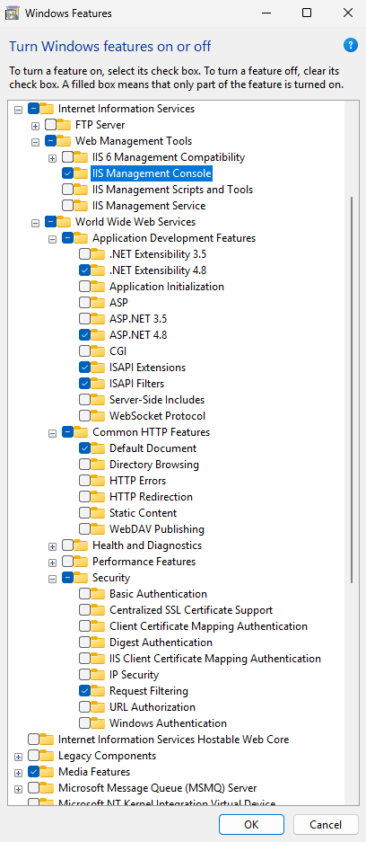
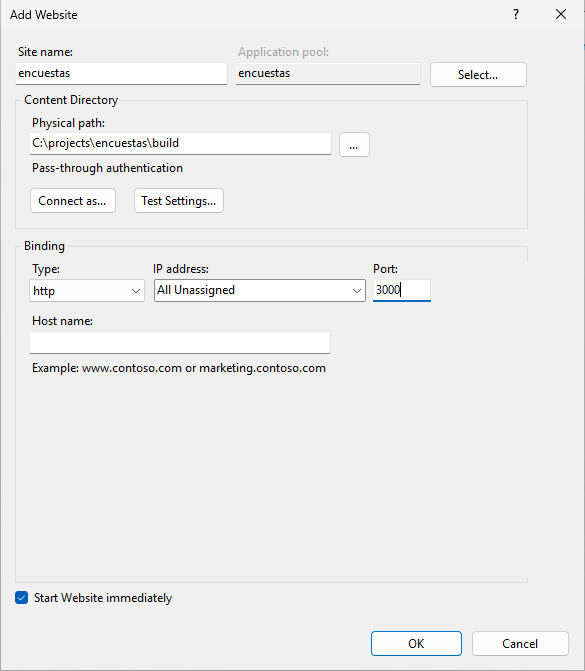
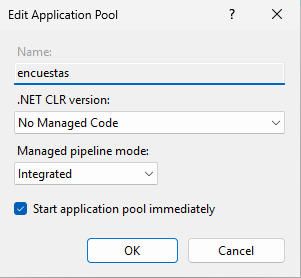
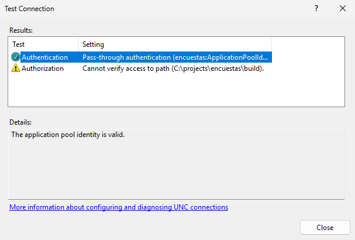
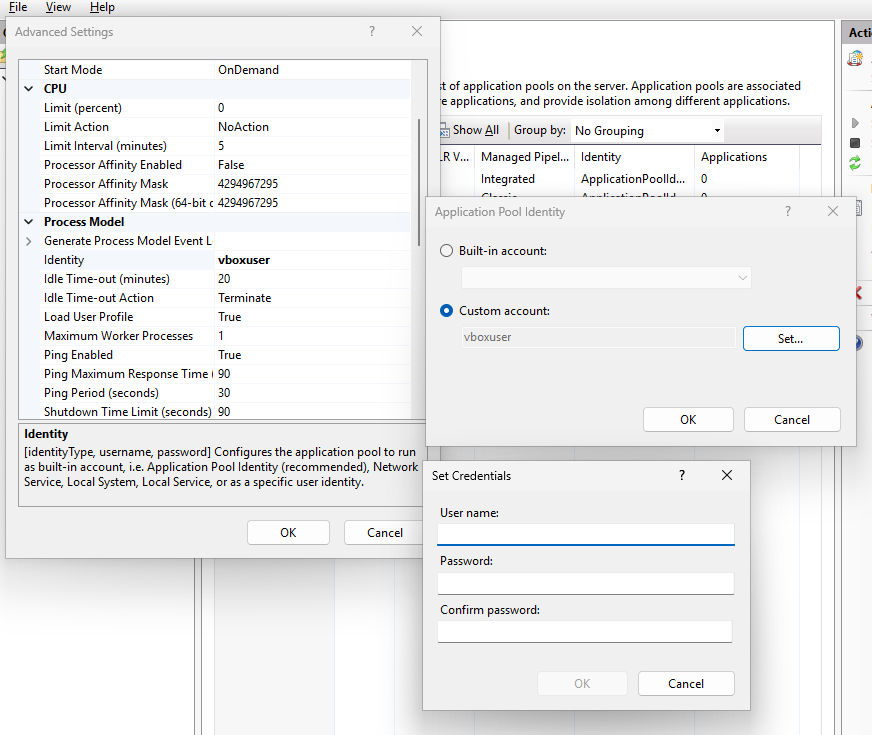
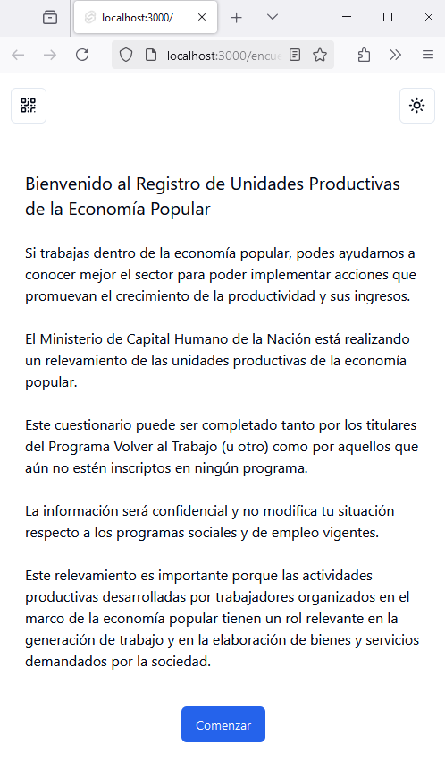

# Implementación de aplicaciones Node.js en IIS

El presente documento tiene por objeto detallar los pasos necesarios para implementar una aplicación en Node.js en entornos Windows.

## Resumen sumario

**Requisitos previos**

- instalar Node LTS (actualmente la versión es v22.12.0) [link de descarga](https://nodejs.org/dist/v22.12.0/node-v22.12.0-x64.msi)
- instalar pnpm (desde una consola de Power-shell ejecutar `Invoke-WebRequest https://get.pnpm.io/install.ps1 -UseBasicParsing | Invoke-Expression`)
- instalar IIS (con IIS Management Console y ASP.NET 4.8 cons sus dependencias)
- instalar Módulo URL Rewrite 2.1 - [link de descarga](https://download.microsoft.com/download/1/2/8/128E2E22-C1B9-44A4-BE2A-5859ED1D4592/rewrite_amd64_en-US.msi)
- instalar Modulo IISNode - [link de descarga](https://github.com/Azure/iisnode/releases/download/v0.2.26/iisnode-full-v0.2.26-x64.msi)
- instalar git for windows - [link de descarga](https://github.com/git-for-windows/git/releases/download/v2.47.1.windows.1/Git-2.47.1-64-bit.exe)

**Clonar el repositorio de la aplicación**

- clonar el repositorio en una carpeta de trabajo

```shell
$ git clone https://github.com/opensas/encuestas.git

$ cd encuestas
```

**Compilar y poner en producción la última versión de la aplicación**

Cada vez que se quiera compilar la aplicación a partir de la última versión del código fuente:

> estos son los comandos que habría que ejecutar para armar un pipeline que automatice el proceso de build y deploy

```shell
# traer la ultima versión de la aplicación
$ git pull

# instalar dependencias
$ pnpm install --prod --frozen-lockfile

# compilar la aplicación
# en la carpeta `build` quedará la aplicación compilada y el archivo web.config
$ pnpm build
```

**Crear la aplicación en IIS**

- configurar como `Physical path` la carpeta `build`
- elegir un puerto para exponer la aplicación (ej: 3000)
- configurar el pool de la aplicación
  - .NET CLR version: No Managed Code
  - otorgar permisos sobre la carpeta `build` a la cuenta del pool de aplicaciones: Advanced Settings, Process Model, Identity

**Probar la aplicación**

Navegar a `http://localhost:3000`

## Información detallada

### Node

Node.js es un entorno de ejecución de JavaScript multiplataforma. Ofrece una forma eficiente de ejecutar código JavaScript en el servidor, permitiendo el desarrollo de aplicaciones escalables y de alto rendimiento. Es uno de los entornos de ejecución más populares del mundo para el desarrollo de aplicaciones web. Su popularidad se debe a su capacidad para manejar una gran cantidad de conexiones concurrentes de manera eficiente, lo que lo hace ideal para aplicaciones web en tiempo real y de alto tráfico.

Instalar la última versión de Node estable con soporte extendido (LTS) [para windows](https://nodejs.org/en/download/prebuilt-installer)

A diciembre de 2024 es la 22.12.0 (disponible [aquí](https://nodejs.org/dist/v22.12.0/node-v22.12.0-x64.msi))

Verificar:

```shell
$ node --version
v22.12.0
```

**Probar una aplicación simple**

Crear una carpeta `node-test` con el siguiente archivo `index.mjs`

```javascript
import http from 'http';

const port = process.env.SOCKET_PATH || parseInt(process.env.PORT) || 3000;

http
	.createServer((req, res) => {
		res.writeHead(200, { 'Content-Type': 'application/json' });
		res.end(JSON.stringify({ message: 'Hello, World!' }));
	})
	.listen(port, () => {
		console.log(`Server running on port http://localhost:${port}`);
	});
```

Ejecutar la aplicación:

```shell
$ node index.mjs
Server running on port http://localhost:3000
```

En otra consola ejecutar

```shell
> curl -v http://localhost:3000
VERBOSE: GET with 0-byte payload
VERBOSE: received -1-byte response of content type application/json

StatusCode        : 200
StatusDescription : OK
Content           : {"message":"Hello, World!"}
[...]
```

### pnpm

pnpm (Performant npm) es un administrador de paquetes para proyectos de JavaScript, que permite a los desarrolladores instalar, actualizar y gestionar dependencias para sus proyectos de Node.js.

Abrir una consola de PowerShell y ejecutar (ver [documentación](https://pnpm.io/installation#on-windows)

```shell
Invoke-WebRequest https://get.pnpm.io/install.ps1 -UseBasicParsing | Invoke-Expression
```

Verificar

```shell
$ pnpm --version
9.15.0
```

### IIS - Internet Information Services

Start -> Turn windows features on or off

Seleccionar al menos las siguientes opciones:

- Internet Information Services
  - Web Management Tools, IIS Management Console
  - World Wide Web Services, Application Development Features
    - ASP.NET 4.8 (y todos sus dependencias)



### Módulo URL Rewrite 2.1 para IIS

[IIS URL Rewrite 2.1](https://www.iis.net/downloads/microsoft/url-rewrite) es una herramienta que permite a los administradores web crear reglas para personalizar direcciones URL y mejorar la experiencia del usuario y la visibilidad en motores de búsqueda.

[Link de descarga](https://download.microsoft.com/download/1/2/8/128E2E22-C1B9-44A4-BE2A-5859ED1D4592/rewrite_amd64_en-US.msi)

### Modulo IISNode

[IISNode](https://github.com/Azure/iisnode) es un módulo nativo de IIS que permite alojar aplicaciones de Node.js en IIS en Windows.

Estas son sus principales ventajas:

- Experiencia de administración integrada: está integrado con el sistema de configuración de IIS.
- Actualización automática: recicla automáticamente los procesos node.exe cuando se actualiza algún archivo de la aplicación.
- Gestión de procesos: gestiona la vida útil de los procesos node.exe, mejorando la confiabilidad.
- Escalabilidad en servidores multi-core: permite la creación de varios procesos node.exe por aplicación, mejorando la escalabilidad.
- Otros beneficios: permite compartir de puertos, brinda mayor seguridad, reescritura de URL, compresión, almacenamiento en caché y registro.

Página del módulo: https://github.com/Azure/iisnode

[Link de descarga](https://github.com/Azure/iisnode/releases/download/v0.2.26/iisnode-full-v0.2.26-x64.msi)

### Git for windows

[Git](https://git-scm.com/downloads/win) es un sistema de control de versiones distribuido de código abierto y gratuito diseñado para manejar desde proyectos pequeños hasta muy grandes con velocidad y eficiencia.

[Link de descarga](https://github.com/git-for-windows/git/releases/download/v2.47.1.windows.1/Git-2.47.1-64-bit.exe)

## Compilación de la aplicación encuestas desde el código fuente

Descargar el código fuente

```shell
# clonar repositorio
$ git clone https://github.com/opensas/encuestas.git

$ cd encuestas

# instalar dependencias
$ pnpm install --prod --frozen-lockfile
Packages: +346
Progress: resolved 346, reused 346, downloaded 0, added 346, done

dependencies:
+ bits-ui 0.21.13
[...]
+ vitest 2.0.5

Done in 32.1s

# compilar aplicación
$ pnpm build

> vite build

.svelte-kit/output/client/.vite/manifest.json                                  14.60 kB │ gzip:   1.77 kB
[...]
.svelte-kit/output/server/chunks/EncuestasQR.js                               399.82 kB
✓ built in 1m 24s

Run npm run preview to preview your production build locally.

> Using sveltekit-adapter-node-iis
  ✔ done
```

La aplicación `encuestas` está configurada para generar de manera automática:

- el código compilado en la carpeta `build`
- el archivo `build/web.config` para configurar el sitio web en IIS

```xml
<?xml version="1.0" encoding="UTF-8"?>
<configuration>
    <system.webServer>
        <handlers>
            <add name="iisnode" path="server.cjs" verb="*" modules="iisnode" />
        </handlers>
        <iisnode
            nodeProcessCommandLine="&quot;C:\Program Files\nodejs\node.exe&quot;"
            watchedFiles="web.config;*.js;*.cjs"
        />
        <rewrite>
            <rules>
                <!-- All other URLs are mapped to the node.js site entry point -->
                <rule name="node">
                    <match url=".*" />
                    <action type="Rewrite" url="server.cjs" />
                </rule>
            </rules>
          <!-- Change it back if Location Header got rewrited-->
            <outboundRules>
                <rule name="back">
                    <match serverVariable="RESPONSE_Location" pattern="(.*)/server.cjs" />
                    <action type="Rewrite" value="{R:1}" />
                </rule>
        </outboundRules>
        </rewrite>
        <defaultDocument>
            <files>
                <add value="server.cjs" />
            </files>
        </defaultDocument>
        <httpErrors errorMode="Detailed" />
    </system.webServer>
</configuration>
```

## Configuración del sitio web en IIS

A continuación es preciso crear una nueva aplicación en IIS que actuara como reverse proxy, recibiendo las solicitudes http que serán redirigidas a la aplicación node.

Crear un nuevo sitio web, elegir como `Physical path` la carpeta build del proyecto, y elegir el puerto en el cual será publicada la aplicación.



Configurar el application pool, estableciendo la opción `.Net CLR version` como `No Managed Code`



Ajustar los permisos de la cuenta utilizada por el pool para que pueda acceder a la carpeta `build`. Verificarlo desde la opción `Basic Settings` del sitio web, presionando el botón `Test Settings...`



Configurar la cuenta a utilizar desde la opción `Applications Pools`, `encuestas`, `Advanced Settings`, `Process Model`, `Identity`



> Si al actualizar la configuración de la aplicación surge un error del tipo `Keyset does not exist / Identity invalid`, probar ejecutando `iisreset` desde una consola como administrador

## Probar la aplicación

Navegar a `http://localhost:3000`



## Sistema Operativo de referencia

Este documento ha sido elaborado utilizando el siguiente sistema operativo de referencia:

```
Edition Windows 11 Enterprise Evaluation
Version 24H2
OS build 26100.1742
Experience Windows Feature Experience Pack 1000.26100.18.0
```

La versión de evaluación utilizada está disponible [aquí](https://www.microsoft.com/en-us/evalcenter/evaluate-windows-11-enterprise)

## Recursos adicionales

- repositorio en github del modulo [Azure/iisnode](https://github.com/Azure/iisnode?tab=readme-ov-file#hosting-nodejs-applications-in-iis-on-windows)
- pagina del módulo de IIS [URL Rewrite](https://www.iis.net/downloads/microsoft/url-rewrite)
- repositorio en github del adaptador [sveltekit-adapter-node-iis](https://github.com/Vuferen/sveltekit-adapter-node-iis)
- [pregunta en StackOverflow](https://stackoverflow.com/questions/76710978/host-sveltekit-project-in-microsoft-iis/76883862#76883862) acerca de la instalación de aplicaciones node en IIS
